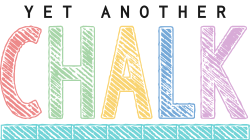

<h1 align="center">
	<br>
	<br>
	
	<br>
	<br>
	<br>
</h1>

> Terminal string styling done right

This is a feature-complete clone of the awesome [Chalk](https://github.com/chalk/chalk) (JavaScript) library.

All **credits go to Sindre Sorhus**.

[](https://badge.fury.io/py/yachalk)
[](https://github.com/bluenote10/yachalk/actions?query=workflow%3Aci)
[](https://codecov.io/gh/bluenote10/yachalk)
[](https://github.com/psf/black)
[](http://mypy-lang.org/)
[](LICENSE)


<br>

---

<br>

## Highlights

- Fluent, auto-complete-friendly API for maximum coding efficiency
- Ability to nest styles
- Proper handling of edge cases (same test cases as Chalk)
- Auto-detection of terminal color capabilities
- [256/Truecolor color support](#256-and-truecolor-color-support), with fallback to basic colors depending on capabilities
- Same conventions as Chalk to manually control color modes via `FORCE_COLOR`
- No dependencies
- Fully typed (mypy strict), no stubs required


## Install

```console
$ pip install yachalk
```

The only requirement is a modern Python (3.6+).

## Usage

```python
from yachalk import chalk

print(chalk.blue("Hello world!"))
```

Chalk comes with an easy to use composable API where you just chain and nest the styles you want.

```python
from yachalk import chalk

# Combine styled and normal strings
print(chalk.blue("Hello") + " World" + chalk.red("!"))

# Compose multiple styles using the chainable API
print(chalk.blue.bg_red.bold("Hello world!"))

# Use within f-strings
print(f"Found {chalk.bold(num_results)} results.")

# Pass in multiple arguments
print(chalk.blue("Hello", "World!"))

# Nest styles...
print(chalk.red(f"Hello {chalk.underline.bg_blue('world')}!"))

# Nest styles of the same type even (color, underline, background)
print(chalk.green(
    "I am a green line " +
    chalk.blue.underline.bold("with a blue substring") +
    " that becomes green again!"
))

# Use RGB or HEX colors
print(chalk.rgb(123, 45, 67).underline("Underlined reddish color"))
print(chalk.hex("#DEADED").bold("Bold gray!"))
```

Easily define your own themes:

```python
from yachalk import chalk

error = chalk.bold.red
warning = chalk.hex("#FFA500")

print(error("Error!"))
print(warning("Warning!"))
```


## API

### chalk.`<style>[.<style>...](string, [string...])`

Example: `chalk.red.bold.underline("Hello", "world")`

Chain [styles](#styles) and call the last one as a method with a string argument. Order doesn't matter, and later styles take precedent in case of a conflict. This simply means that `chalk.red.yellow.green` is equivalent to `chalk.green`.

Multiple arguments will be separated by a space, but the separator can also be passed in as keyword argument `sep="..."`.


## Styles

### Modifiers

- `reset` - Resets the current color chain.
- `bold` - Make text bold.
- `dim` - Emitting only a small amount of light.
- `italic` - Make text italic. *(Not widely supported)*
- `underline` - Make text underline. *(Not widely supported)*
- `inverse`- Inverse background and foreground colors.
- `hidden` - Prints the text, but makes it invisible.
- `strikethrough` - Puts a horizontal line through the center of the text. *(Not widely supported)*
- `visible`- Prints the text only when Chalk has a color level > 0. Can be useful for things that are purely cosmetic.

### Colors

- `black`
- `red`
- `green`
- `yellow`
- `blue`
- `magenta`
- `cyan`
- `white`
- `black_bright` (alias: `gray`, `grey`)
- `red_bright`
- `green_bright`
- `yellow_bright`
- `blue_bright`
- `magenta_bright`
- `cyan_bright`
- `white_bright`

### Background colors

- `bg_black`
- `bg_red`
- `bg_green`
- `bg_yellow`
- `bg_blue`
- `bg_nagenta`
- `bg_cyan`
- `bg_white`
- `bg_black_bright` (alias: `bg_gray`, `bg_grey`)
- `bg_red_bright`
- `bg_green_bright`
- `bg_yellow_bright`
- `bg_blue_bright`
- `bg_magenta_bright`
- `bg_cyan_bright`
- `bg_white_bright`


## 256 and Truecolor color support

Chalk supports 256 colors and [Truecolor](https://gist.github.com/XVilka/8346728) (16 million colors) on supported terminal apps.

Colors are downsampled from 16 million RGB values to an ANSI color format that is supported by the terminal emulator (or by setting a specific `ColorMode` manually). For example, Chalk configured to run at level `ColorMode.Basic16` will downsample an RGB value of #FF0000 (red) to 31 (ANSI escape for red).

Examples:

- `chalk.rgb(15, 100, 204)("Hello!")`
- `chalk.hex("#DEADED").underline("Hello, world!")`

Background versions of these models are prefixed with `bg_`:

- `chalk.bg_rgb(15, 100, 204)("Hello!")`
- `chalk.bg_hex("#DEADED").underline("Hello, world!")`

